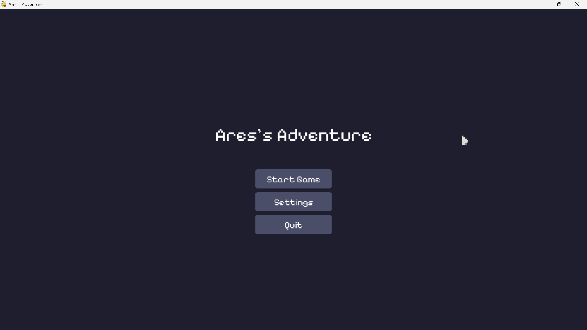
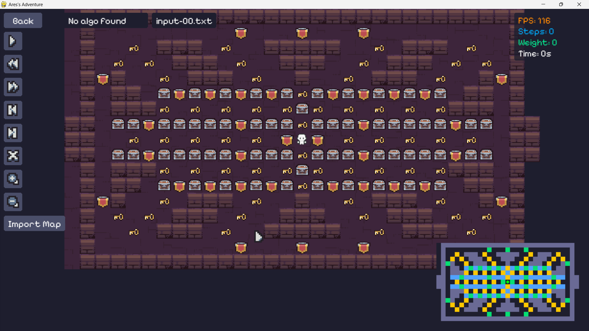
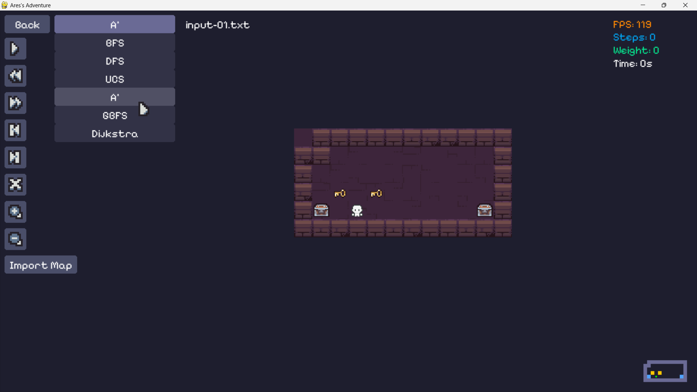
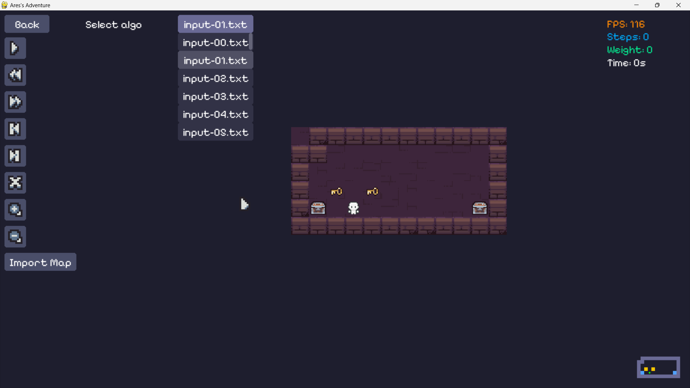
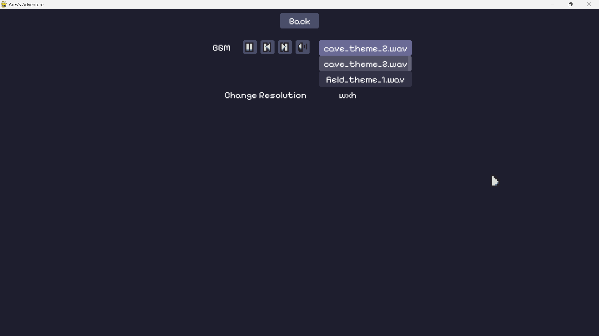
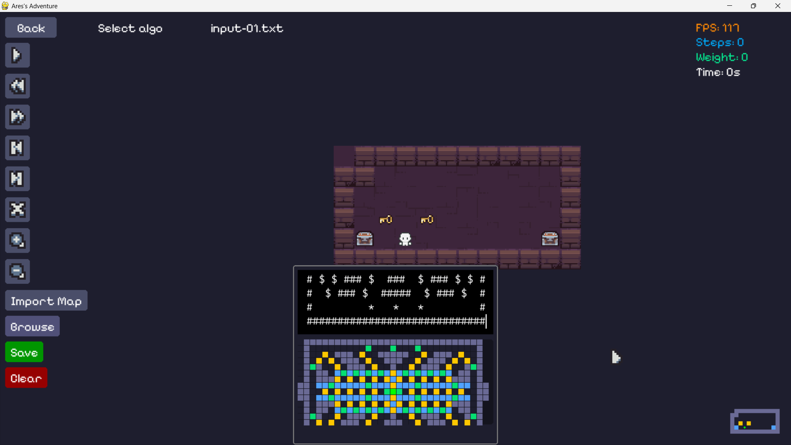

<h1 align="center">Ares</h1>
<p align="center" style="font-size:16px"><strong></strong></p>
<p align="center">  
  
</p>

<p align="center">
  
  
  
  
  
</p>

## Tech Stack


## Screenshots

<div style="display:flex;gap:12px;justify-content:center">
	
	
</div>
<div style="display:flex;gap:12px;justify-content:center">
	
	
</div>
<div style="display:flex;gap:12px;justify-content:center">
	
	
</div>

## Quick Start

- This project using [rye](https://rye.astral.sh/) as package manager.

**Install dependencies**

```bash
rye sync
```

or

```bash
pip install -r requirements.txt
```

**Running the Project**

```bash
rye run solve
```

or

```bash
rye run dev
```

or

```bash
rye run ares
```

or

```bash
rye run ares [OPTIONS]

Options:
	-v,	--version	Print the version
		--gui		Using GUI
```

**Testing**

```bash
rye test
```

**Linting**

```bash
rye lint
```

**Formatting**

```bash
rye fmt
```

## Guide

- Read project guide [here](./Source/md/guide.md)
